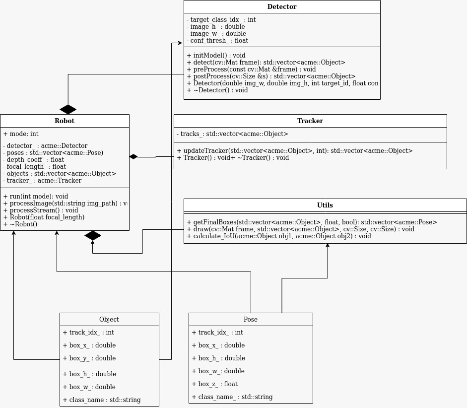

[](https://github.com/adithyagaurav/Human_Detection_Tracker/actions/workflows/build_and_coveralls.yml)
[](https://coveralls.io/github/adithyagaurav/Human_Detection_Tracker?branch=master)
[](https://opensource.org/licenses/MIT)


# ENPM 808X Midterm Project 

# Human Detection and Tracking

# Team Members
 - **Driver** : Adithya Singh (UID - 117507047)
 - **Navigator** : Rishabh Singh (UID - 117511208)
 - **UMD Design Kepeer** : Divyansh Agarwal (UID - 117730692)

## Overview

This project is developed for ACME robotics to implement a Human Detection and Tracking functionality. The project has 3 main contirbutions, which are as follows:

1. Detector :  YoloV4 is used to detect humans in images and videos
2. Tracker : When processing a stream of frames, each bounding box around a human is given a ID which tracks the bounding box throught the frame
3. Pose Estimation : Each detection is obtained in image frame and then converted to robot frame using focal length and lens formula.

The project has two modes of operations, image mode and stream mode. In image mode, model performs detection on a single image and draws the bounding box around all detections. In stream mode, model processes a stream of images from a webcam, and tracks each objects through the frames.

We decided to opt for the deep learning approach for this project over tradtional detection approaches due to its high performance and low latency qualities. We use OpenCV frame work for this project which used its dnn libraries to perform neural network operations.


## Video Presentation

Video URL : [Google Drive Link](https://drive.google.com/file/d/1CmQ9QwxbvStY9G-XkPPm0ErwoJgXboIH/view?usp=sharing)

 ## UML Class Diagram

 


## Demo Output


## Sprints and Backlogs
For this project Agile Iterative Process techniques were followed.
Sprint URL : [Sprint](https://docs.google.com/document/d/1zNT1Lpt2RIhAPXhDCSRGpUpMemdmEOlnC4JlLw5574I/edi)
Product & Interation Backlog : [ProductBCK](https://docs.google.com/spreadsheets/d/11ZNZkYG7Tr5bm_ZU3U6apQA8bG3-O703KbSEKB_j2WA/edit#gid=0)

## Phase 1
In phase 1, we were able to implement the image mode of the project, stubs have been written for stream mode of the project and is expected to be completed by phase 2.

## Standard install via command-line
```
git clone --recursive https://github.com/dpiet/cpp-boilerplate
cd <path to repository>
mkdir build
cd build
cmake ..
make
Run tests: ./test/cpp-test
Run program: ./app/shell-app
```

## Building for code coverage (for assignments beginning in Week 4)
```
sudo apt-get install lcov
cmake -D COVERAGE=ON -D CMAKE_BUILD_TYPE=Debug ../
make
make code_coverage
```
This generates a index.html page in the build/coverage sub-directory that can be viewed locally in a web browser.

## Working with Eclipse IDE ##

## Installation

In your Eclipse workspace directory (or create a new one), checkout the repo (and submodules)
```
mkdir -p ~/workspace
cd ~/workspace
git clone --recursive https://github.com/dpiet/cpp-boilerplate
```

In your work directory, use cmake to create an Eclipse project for an [out-of-source build] of cpp-boilerplate

```
cd ~/workspace
mkdir -p boilerplate-eclipse
cd boilerplate-eclipse
cmake -G "Eclipse CDT4 - Unix Makefiles" -D CMAKE_BUILD_TYPE=Debug -D CMAKE_ECLIPSE_VERSION=4.7.0 -D CMAKE_CXX_COMPILER_ARG1=-std=c++14 ../cpp-boilerplate/
```

## Import

Open Eclipse, go to File -> Import -> General -> Existing Projects into Workspace -> 
Select "boilerplate-eclipse" directory created previously as root directory -> Finish

# Edit

Source files may be edited under the "[Source Directory]" label in the Project Explorer.


## Build

To build the project, in Eclipse, unfold boilerplate-eclipse project in Project Explorer,
unfold Build Targets, double click on "all" to build all projects.

## Run

1. In Eclipse, right click on the boilerplate-eclipse in Project Explorer,
select Run As -> Local C/C++ Application

2. Choose the binaries to run (e.g. shell-app, cpp-test for unit testing)


## Debug


1. Set breakpoint in source file (i.e. double click in the left margin on the line you want 
the program to break).

2. In Eclipse, right click on the boilerplate-eclipse in Project Explorer, select Debug As -> 
Local C/C++ Application, choose the binaries to run (e.g. shell-app).

3. If prompt to "Confirm Perspective Switch", select yes.

4. Program will break at the breakpoint you set.

5. Press Step Into (F5), Step Over (F6), Step Return (F7) to step/debug your program.

6. Right click on the variable in editor to add watch expression to watch the variable in 
debugger window.

7. Press Terminate icon to terminate debugging and press C/C++ icon to switch back to C/C++ 
perspetive view (or Windows->Perspective->Open Perspective->C/C++).


## Plugins

- CppChEclipse

    To install and run cppcheck in Eclipse

    1. In Eclipse, go to Window -> Preferences -> C/C++ -> cppcheclipse.
    Set cppcheck binary path to "/usr/bin/cppcheck".

    2. To run CPPCheck on a project, right click on the project name in the Project Explorer 
    and choose cppcheck -> Run cppcheck.


- Google C++ Sytle

    To include and use Google C++ Style formatter in Eclipse

    1. In Eclipse, go to Window -> Preferences -> C/C++ -> Code Style -> Formatter. 
    Import [eclipse-cpp-google-style][reference-id-for-eclipse-cpp-google-style] and apply.

    2. To use Google C++ style formatter, right click on the source code or folder in 
    Project Explorer and choose Source -> Format

[reference-id-for-eclipse-cpp-google-style]: https://raw.githubusercontent.com/google/styleguide/gh-pages/eclipse-cpp-google-style.xml

- Git

    It is possible to manage version control through Eclipse and the git plugin, but it typically requires creating another project. If you're interested in this, try it out yourself and contact me on Canvas.
